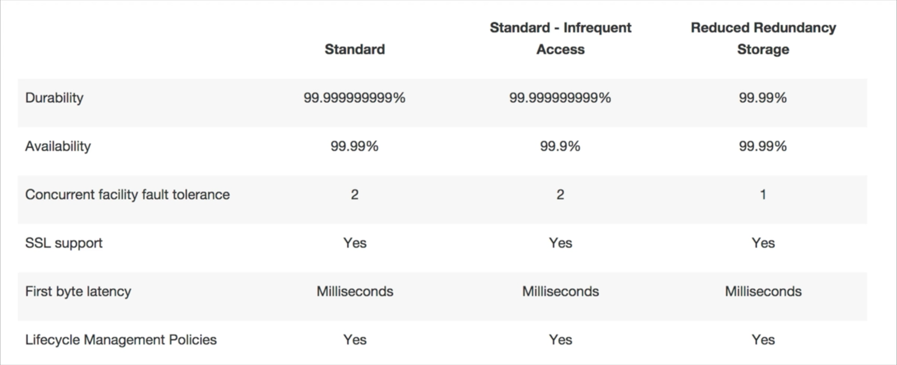

# AWS ASSOCIATED NOTES

## S3

- S3 provides developers and IT team with secure, durable, highly-scalable **_object storage_**.

### Main Features

- Each Objects consists of the following:
  - **Key**: The object name.
  - **Value**: The data and is made up of a sequence of bytes.
  - **Version ID**: Needed for versioning.
  - **Metadata**
  - **Sub-resources**: Access Control List + Torrent.

- Files can be **from 0 Bytes to 5TB**.
- There is **unlimited storage**.
- Files are stored in **Buckets**.
- **Tiered Storage** available.
- **Upload** an object to S3 receive a **HTTP 200** code.
- By **default** buckets are **private** and all objects stored inside.
- S3 is a **universal namespace**, that is, names must be *unique globally*.
- Example bucket url: **https://s3-eu-west-1.amazonaws.com/romruben**.
- Not suitable to install an operating system on.
- Great backup tool.
- s3 faster upload with **multipart**.

#### Consistence Model

- **Read after Write** consistency for **PUTS of new Objects**.
- **Eventual** consistency for **overwrite PUTS and DELETES** (can take some time to propagate).

#### S3 Storage Tiers/Classes

  - **S3** (durable, immediately available, frequently accessed): 99.99% availability, 9,11*9% durability.

  - **S3-IA** (Infrequently Accessed)(durable, immediately available, infrequently accessed): For data that is accessed less frequently, but requires rapid access when needed. Lower fee than S3, but you are charged a retrieval fee.

  - **Reduced Redundancy Storage** (data that is easily reproducible, such as thumbnails etc): Designed to provide 99,99% durability and 99,99% availability of objects over a given year.

  - **Glacier** (Archived data): Very cheap, but used for archival only. It takes 3-5 hours to restore from Glacier.

#### Versioning

- Stores all versions of an object (including all writes and even if you delete an object).
- Once enabled, versioning cannot be disabled, only suspended.
- Versioning MFA Delete capability, using MFA auth, can be used to provide an additional layer of security.

#### Lifecycle Management

- Integrates with lifecycle rules.
- Can be used in conjunction with Versioning.
- Can be applied to current versions and previous versions.
- Following actions can now be done:
  - Transition to the standard - Infrequent Access storage Classes (128Kb and 30 days after the creation date)
  - Archive to the Glacier Storage Class (30 days after IA, if relevant)
  - Permanent delete
- Cross Region Replication, requires versioning enabled on the source bucket.

#### Encryption

  - In Transit: when you are sending information: SSL / TLS
  - At Rest:
    - Server Side Encryption:
      - S3 Managed Keys: SS3 - S3.
      - AWS Key Management Service, Managed Keys: SSE-KMS.
      - Server side Encryption with customer provider keys: SSE-C.
    - Client Side Encryption.

#### Securization
- Secure your data doing Access Control Lists and Bucket Policies.
- S3 buckets can be configured to created access logs which log all requests made to the S3 buckets. This can be done to another bucket.

#### Static Websites

- You can use s3 to host static websites.
- Serverless.
- Very cheap, scales automatically.
- Static only, cannot host dynamic sites.

#### Transfer Acceleration

S3 Transfer Acceleration utilize the CloudFront Edge Network to accelerate your uploads to S3. Instead of uploading directly to your S3 bucket, you can use a distinct URL to upload directly to an edge location which will then transfer that file to S3. You will get a distinct URL to upload to; romruben.s3-accelerate.amazonaws.com ie.

### Labs

- In  a bucket replication scenario, a change in source directory is
applied into the dest bucket such as permissions change.
- Versioning must be enabled on both the source and destination buckets.
- Regions must be unique.
- Files in an existing bucket are not replicated automatically. All subsequent updated files will be replicated automatically.
- You cannot replicate to multiple buckets or use daisy chaining (at this time.)
- Delete markers are replicated.
- Deleting individual versions or delete markers will not be replicated.
- Understand what Cross Region Replication is at a high level.

### Exam notes
